# Credit Risk Modeling

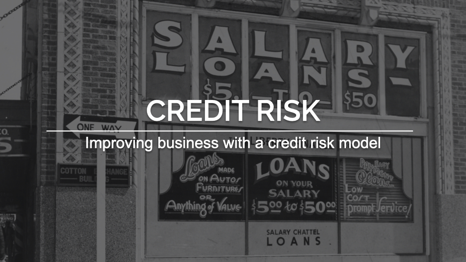

# 1.0 The context

## 1.1 What Is Credit Risk?

Credit risk is the possibility of a loss resulting from a borrower's failure to repay a loan or meet contractual obligations. Traditionally, it refers to the risk that a lender may not receive the owed principal and interest, which results in an **interruption of cash flows and increased costs for collection**. Excess cash flows may be written to provide additional cover for credit risk. When a lender faces heightened credit risk, it can be mitigated via a higher coupon rate, which provides for greater cash flows.

Although it's impossible to know exactly who will default on obligations, **properly assessing and managing credit risk can lessen the severity of a loss**. Interest payments from the borrower or issuer of a debt obligation are a lender's or investor's reward for assuming credit risk.

Thus, in order to prevent losses, a proper **Credit Risk Management** is a must. However, to design it, companies face some challenges that are oftentimes costly and time consuming.

In addition, due to COVID-19, companies will need to strengthen their Credit Risk Management. The Fed has estimated that pandemic-related loan losses for big US banks could reach **\$700 billion** in a worst-case scenario (“double-dip” or W-shaped recession), pushing banks close to their capital minimums.

PS 1: All the references are stated at the end of this README.

PS 2: You can find useful information at **section 1** of my [notebook](https://github.com/brunokatekawa/credit_risk/blob/master/Credit_Risk.ipynb).

 

# 2.0 The challenges

- **A. Inefficient data management.** An inability to access the right data when it’s needed causes problematic delays.

- **B. No groupwide risk modeling framework.** Without it, banks can’t generate complex, meaningful risk measures and get a big picture of groupwide risk.

- **C. Constant rework.** Analysts can’t change model parameters easily, which results in too much duplication of effort and negatively affects a bank’s efficiency ratio.

- **D. Insufficient risk tools.** Without a robust risk solution, banks can’t identify portfolio concentrations or re-grade portfolios often enough to effectively manage risk.

- **E. Cumbersome reporting.** Manual, spreadsheet-based reporting processes overburden analysts and IT.

 

# 3.0 The solution

In this project, I managed to address **challenges B, D and E** by developing a credit risk model that intakes a portfolio of potential customers (.csv file), builds a strategy table and calculates the total expected loss, assuming that the exposure is the full value of the loan, and the loss given default is 100%. This means that a default on each loan is a loss of the entire amount.

 

## 3.1 What drove the solution

### 3.1.1 Exploratory Data Analysis

#### Descriptive Analysis

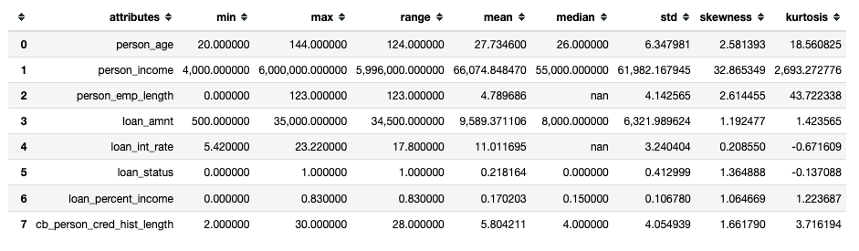

Key points:

- There are **all sorts of ages** ranging from 20 to 100+ (outliers were later removed).
- There are **all sorts of loan amount**, ranging from $500 to $35K.
- Some people allocate high percentage of their income to the loan (max = 83%!).
- By lookin at employment length and credit history, there are people that have been in their early years as employees.

 

#### Hypothesis Map

This map to help us to decide which variables we need in order to validate the hypotheses.

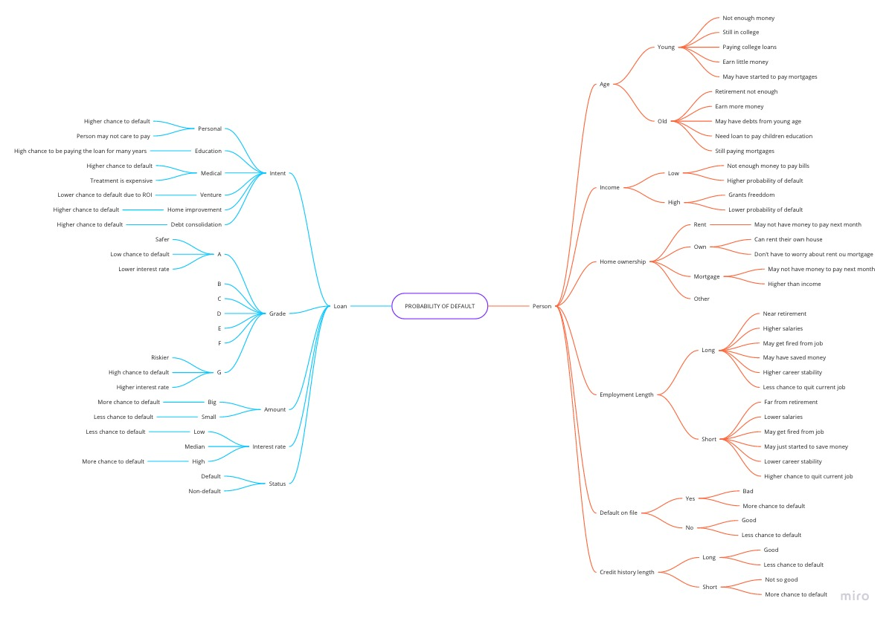

#### Univariate Analysis

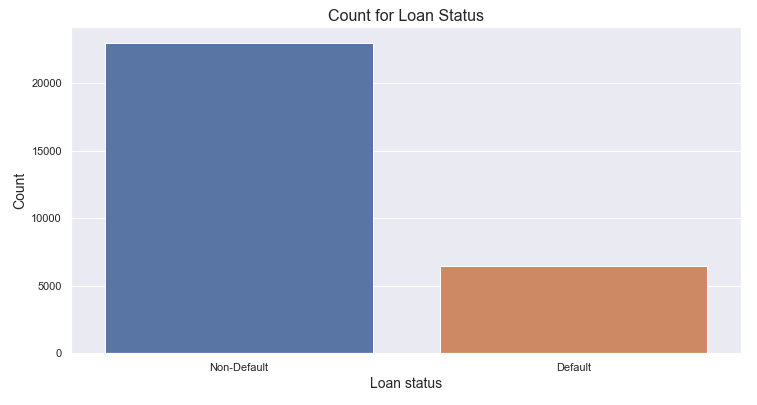

Number of default cases: 6,463 (21.94% of the total loans).

Number of non-defualt cases: 22,996 (78.06% of the total loans).

 

### 3.1.2 Hypothesis validation - Bivariate Analysis

#### Main Hypothesis

#### H3. The median percentage of income to the loan is higher for default than the median for non-default. (TRUE)

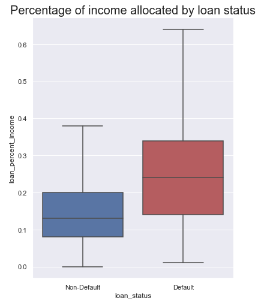

As observed, the median of the percentage of income allocated is higher for people who default than for the people who don't.

> Thus, the hypothesis is **TRUE**.

#### H4. Mortgage have more cases of default, followed by rent and own. (FALSE)

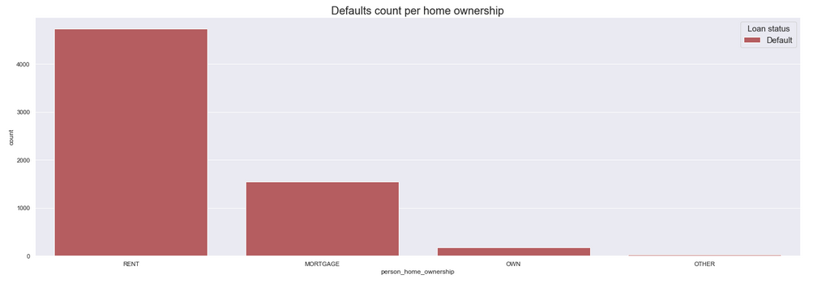

As observed, `RENT` is the top home ownership type for people who default, not `MORTGAGE`.

> Thus, the hypothesis is **FALSE**.

#### H6. There are more cases of default for people having history of default. (FALSE)

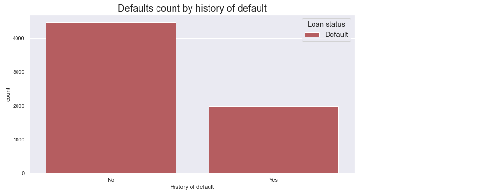

As observed, there are more cases of default for people who don't have history of default.

> Thus, the hypothesis is **FALSE**.

#### H8. There are more cases of default for personal than any other intent. (FALSE)

#### H9. The least cases of default are for venture. (TRUE)

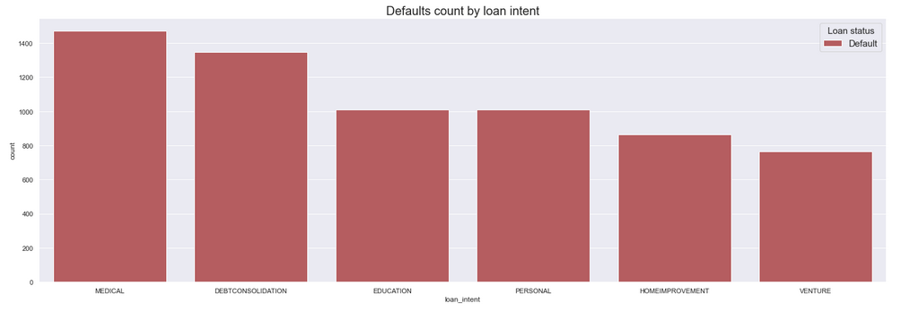

As observed, `MEDICAL` holds the most number of default cases and `VENTURE` the least.

> Thus, the hypothesis is **FALSE**.

#### H10. The higher the grade, the fewer are the cases of default. (FALSE)

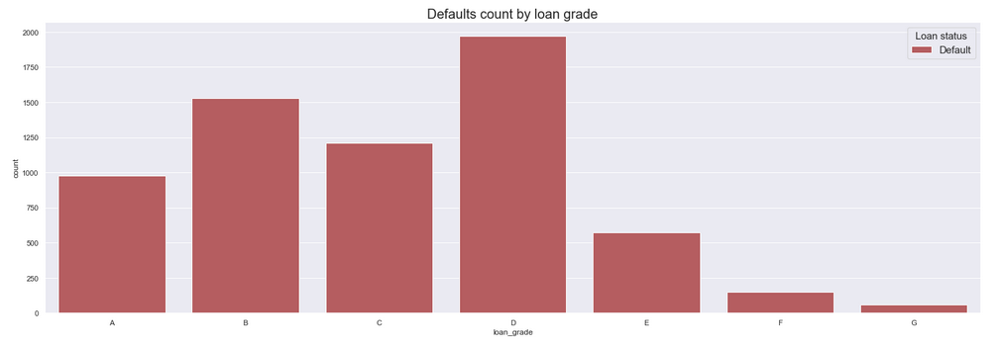

As observed, despite the grade `D` that is right at the middle grade, the higher the loand grade, the higher is the number of default cases.

> Thus, the hypothesis is **FALSE**.

 

#### Hypothesis summary

| ID  | Hypothesis                                                                                         | Conclusion |
| :-: | :------------------------------------------------------------------------------------------------- | :--------: |
| H1  | There are more defaults for young people                                                           |    True    |
| H2  | People who default have lower income than people who not default                                   |    True    |
| H3  | The median percentage of income to the loan is higher for default than the median for non\-default |    True    |
| H4  | Mortgage have more cases of default, followed by rent and own                                      |   False    |
| H5  | The are fewer cases of default for people with long employment length                              |    True    |
| H6  | There are more cases of default for people having history of default                               |   False    |
| H7  | There are fewer cases of default for people having longer credit history length                    |    True    |
| H8  | There are more cases of default for personal than any other intent                                 |   False    |
| H9  | The least cases of default are for venture                                                         |    True    |
| H10 | The higher the grade, the fewer are the cases of default                                           |   False    |
| H11 | The loan amount median for default cases is higher than for non\-default                           |    True    |
| H12 | The interest rate median for default cases is higher than for non\-default                         |    True    |

 

### 3.1.3 Machine Learning

Tests were made using different algorithms.

#### Performance Metrics

The <mark>**highlighted cells**</mark> correspond to the max value at each column.

#### PR Curves

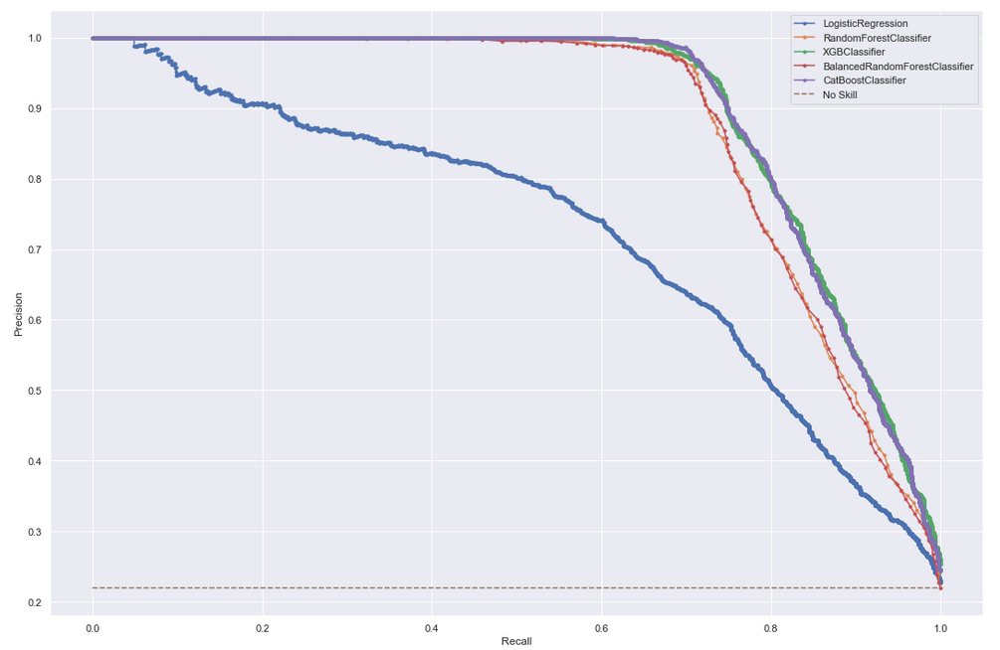

As observed, the PR curves for `XGBoostClassifier` and `CatboostClassifier` are pretty close. However, the Confusion Matrices are different and it helped when deciding which algorithm to choose.

#### Confusion Matrices

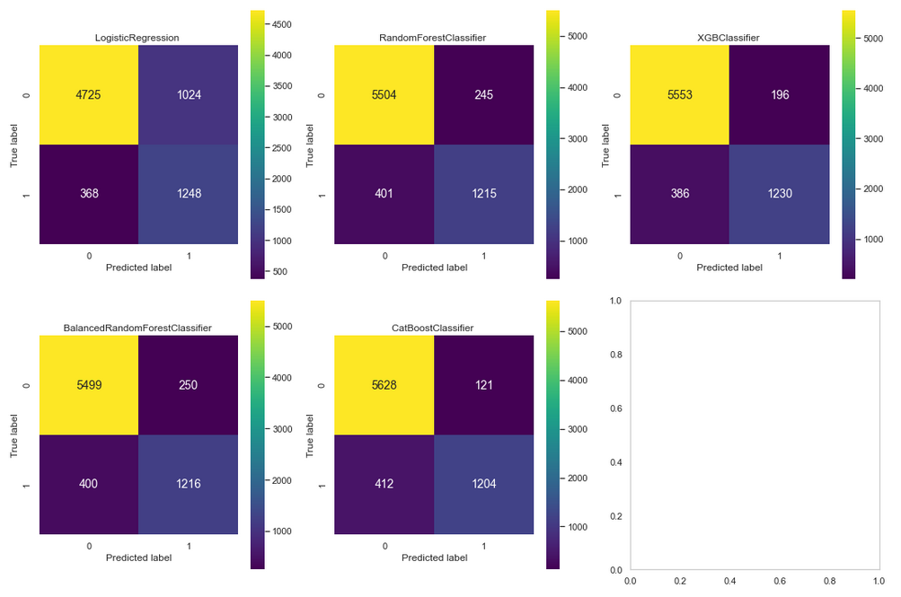

As we defined at Business Metrics section, the `XGBClassifier` satisfies the conditions. But wait, `Logistic Regression` has the least number of FN, why not choosing it? Yes, it has, but the number of FP is way too high (`1024`) compared with other algorithms.

#### 3.1.3.1 Choosing the overall best algorithm

As we are dealing with **imbalaced data set**, the most relevant metric, in this case, is the **F1-Score and Recall** which are used **when the False Negatives and False Positives are crucial**. For this project, False Negatives are crucial, since losing these loans could lead to company financial loss. Thus, the algorithm that best suits the needs is **XGBoost Classifier**.

 

### 3.1.4 Business Performance

When analyzing the performance metrics for classification machine learning algorithms, we often stumble on the **Confusion Matrix**.

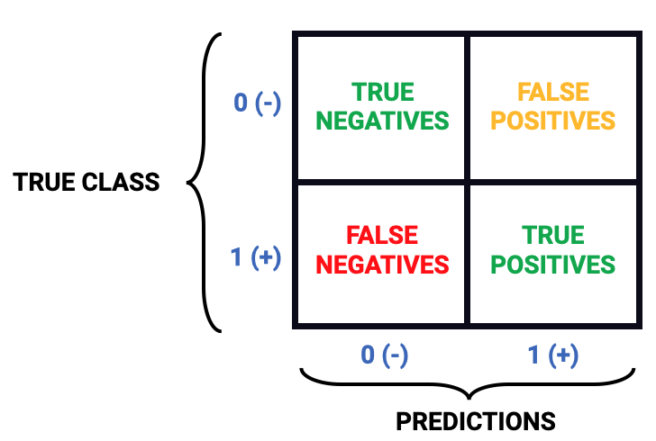

We need to define which case is the **best for the business**:

- A) Reduce False Positives (FP) rather than False Negatives (FN).
- B) Reduce False Negatives (FN) rather than False Positives (FP).

In this project, I assumed that the best case for the business was **option (B)**, that is, **a default on a loan is worse that not giving a loan to a person**.

Thus, it's time to estimate the total expected loss given all our decisions.

- Probabilities of default (**PD**)
- The loss given default (**LGD**)
- The loan amount which will be assumed to be the exposure at default (**EAD**).

Doing the calculations, the **total expected loss is \$19,596,497.74**.

This is the total expected loss for the entire portfolio using the credit risk model developed in this project.

\$19.6 million may seem like a lot, but the total expected loss would have been over $29 million without a proper model and **\$35.4 million without any model at all!** Some losses are unavoidable, but this project here might have saved the company about \$15.8 million dollars.

### 3.1.5 Machine Learning Performance for the chosen algorithm

The chosen algorithm was the **XGBoost Classifier**. In addition, I made a performance calibration on it.

#### Precision and Recall, AUC and Confusion Matrix

| Accuracy | F1-Score | PR AUC | F1-Macro |
| -------- | -------- | ------ | -------- |
| 0.930482 | 0.8257   | 0.9474 | 0.8912   |

 

|              | precision | recall | f1\-score | support |
| -----------: | --------: | -----: | --------: | ------: |
|            0 |     0\.93 |  0\.98 |     0\.96 |    5749 |
|            1 |     0\.92 |  0\.75 |     0\.83 |    1616 |
|     accuracy |           |        |     0\.93 |    7365 |
|    macro avg |     0\.93 |  0\.87 |     0\.89 |    7365 |
| weighted avg |     0\.93 |  0\.93 |     0\.93 |    7365 |

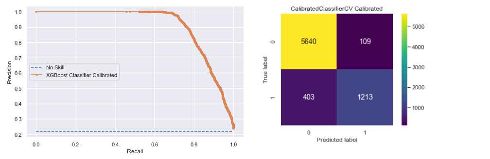

 

# 4.0 Next Steps

**4.1** Address the remaining challenges (A and C).

 

# References

- https://www.lexingtonlaw.com/credit/length-of-credit-history
- https://www.investopedia.com/terms/c/creditrisk.asp
- https://www.youtube.com/watch?v=bx_LWm6_6tA - The Crisis of Credit Visualized
- https://corporatefinanceinstitute.com/resources/knowledge/finance/credit-risk/
- https://www.sas.com/en_us/insights/risk-management/credit-risk-management.html
- https://www.mckinsey.com/business-functions/risk/our-insights/managing-and-monitoring-credit-risk-after-the-covid-19-pandemic
